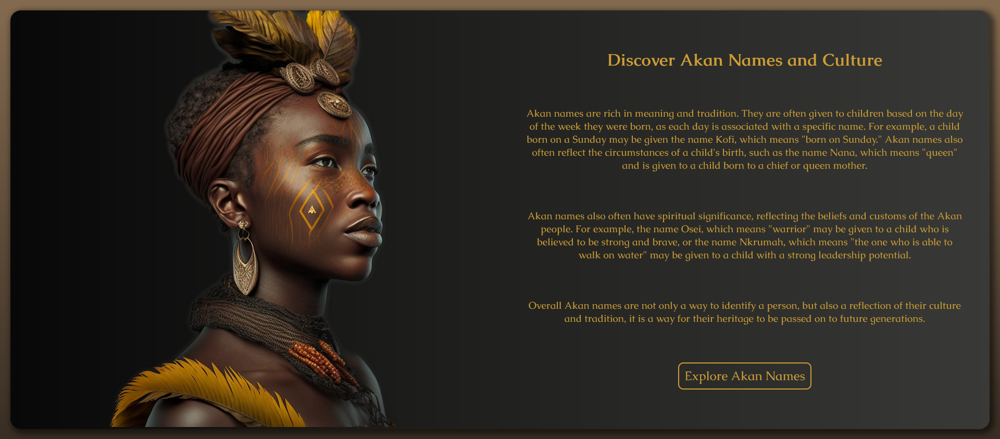

# Akan Name Generator

This project was given to me by my mentor to practice JavaScript.
It's a simple two page website that features the Akan names and culture.
You can input your gender and date of birth and the app will show your Akan name.
The text and the images are generated by AI (ChatGPT and Midjourney).

## Used technologies

- HTML
- CSS
- JavaScript
- jQuery

## Link to the live version

The online hosted version of this app can be found here: [Akan Name Generator](https://schlumen.github.io/akan-name-generator/).